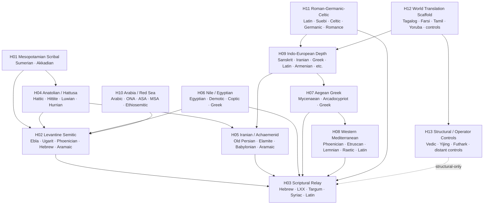

# Global Connectivity Map

Status: **Connected research graph — 2026-09-20**

The current language/lore system is no longer a collection of parallel lists. It is one typed graph.

Current machine-readable inventory:

- **94 language/tradition entries**
- **14 major path families**
- **11 cross-cutting research paths**
- **100+ typed bridge edges after closure**
- one deliberate named data gap: **LinguaDanka**, which remains attached only to the recovery queue until its exact dictionary is recovered.

The counts describe registry objects, not 94 mutually independent languages.

## Master topology



The dotted structural edge is intentional: **graph connection does not equal historical descent**.

## What "connected" means now

Every edge must be one of the bridge classes in the bridge registry:

```text
translation
parallel multilingual witness
recension / recomposition
readout transposition
script / mode transposition
borrowing / calque
function / operator transposition
institutional / liturgical custody
substrate residue
genealogical / dialect transposition
structural control
contact restructuring / creolization
suppressive or imported language shift
unreviewed gloss-translation scaffold
```

That means a distant language can participate without being falsely placed inside an ancient family tree.

## The central historical trunk

```text
Sumerian
   │ scribal/readout custody
   ▼
Akkadian
   │
   ├── Ebla / Mari / Ugarit / Amarna
   │          │
   │          ▼
   │   Northwest-Semitic / Levant
   │          │
   │          ▼
   │     Hebrew / Aramaic
   │          │
   │          ├── Septuagint Greek
   │          ├── Targumic Aramaic
   │          ├── Syriac / Peshitta
   │          ├── Aquila / Greek revision
   │          └── Vulgate Latin
   │                    │
   │                    ▼
   │             later vernacular halo
   │
   ├── Hattusa → Hittite/Luwian/Hurrian
   ├── Achaemenid multilingual field
   └── Egyptian / Levantine contact fields
```

This is a **relay trunk**, not a claim that every branch is genealogically descended from Akkadian.

## The literary/operator trunk

```text
Sumerian Gilgamesh stories
        │ recomposition
        ▼
Akkadian Gilgamesh
        │ recension
        ▼
Old / Standard Babylonian states

Atrahasis ── literary reuse ──► Gilgamesh flood
    │
    └──── shared ANE operator matrix ───► Genesis flood

Enuma Elish
    └──── creation/order operator matrix ─► Genesis 1

Hebrew biblical corpus
    └──── direct translations / interpretations ─►
         Greek · Aramaic · Syriac · Latin

Vedic corpus
    └──── structural-control edge only ─►
         creation/order/ritual operator comparison
```

So the oldest literary material and the scriptural spine are connected **at the strongest level the evidence allows for each edge**.

## Multilingual stepping stones

The graph explicitly uses the ancient record's own bridges:

**Ebla → Mari → Ugarit → Amarna → Hattusa → Byblos → Susa/Behistun → Memphis/Rosetta → Karatepe/Cinekoy → Pyrgi → Letoon.**

Those nodes let us move between language families through actual multilingual environments instead of relying on long unsupported jumps.

## The outer rings are connected too

The recovered World Language & Lore corpus is attached through two different mechanisms.

First, its four deep teaching modules—**Tagalog, Farsi/Persian, Tamil, Yoruba**—remain lexical teaching datasets with their original translation status preserved. Their English glosses are not promoted into historical evidence until reviewed.

Second, the compact controls—Hindi, Turkish, Japanese, Korean, Chinese, Vietnamese, Indonesian, Swahili, Zulu, Haitian Creole, Irish, Welsh, Scottish Gaelic, Romanian, Yiddish, Esperanto, Hawaiian and Navajo—are connected by secure family links where appropriate and otherwise through structural or translation-scaffold edges.

This makes **Haitian Creole** particularly valuable: it now occupies the explicit **contact restructuring / creolization** edge rather than being treated as defective French.

## Social transmission is part of the graph

Every historical edge can additionally carry a social mode:

```text
ORGANIC
SYNTHETIC
SUPPRESSIVE
IMPORTED
CREOLIZING / CONTACT-RESTRUCTURED
ARCHIVAL / LITURGICAL
MIXED
```

That lets the same geographic region contain several simultaneous histories:

```text
household vernacular
+
court language
+
scribal language
+
liturgical language
+
merchant lingua franca
+
conqueror prestige language
+
substrate residue
```

without flattening them into one "language of the place."

## What remains incomplete

Incomplete now means **under-instrumented**, not orphaned.

Examples:

- Old North Arabian and Ancient South Arabian are family-connected but need witness packs.
- Palaic, Sidetic, Lydian, Carian and Phrygian are connected to Anatolian/Balkan lanes but unevenly populated.
- Meroitic, Eteocypriot and Iberian remain boundary nodes with explicit confidence ceilings.
- Kartvelian, Uralic and several world controls are connected primarily as adversarial/structural controls.
- Suebi is historically connected through Roman/Latin custody and migration evidence but still lacks a dense native linguistic witness set.
- LinguaDanka remains a named gap because the project does not possess the exact dictionary.

## Operational invariant

From now on, adding any language, text, inscription, myth, translation, dialect, creole, script, or later residue requires two records:

1. **what the object is**, and
2. **how it connects to the graph**.

No free-floating resemblance is admitted.

The graph may say:

```text
DIRECT
HISTORICAL
CONTROLLED
SHARED MATRIX
STRUCTURAL
CANDIDATE
MISSING
```

but it must say which one.

That gives us one continuous research manifold without erasing the very discontinuities—loss, suppression, translation, recomposition, creolization, migration, and script change—that make the history informative.
